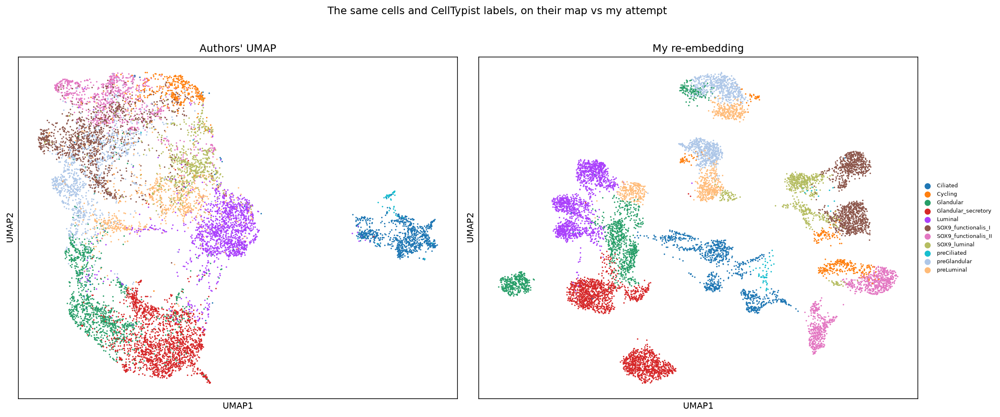
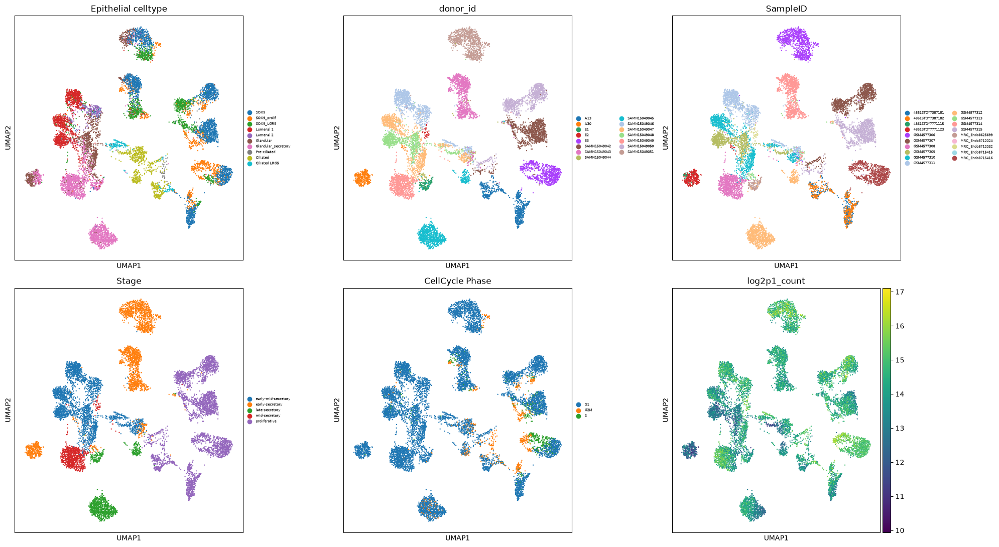
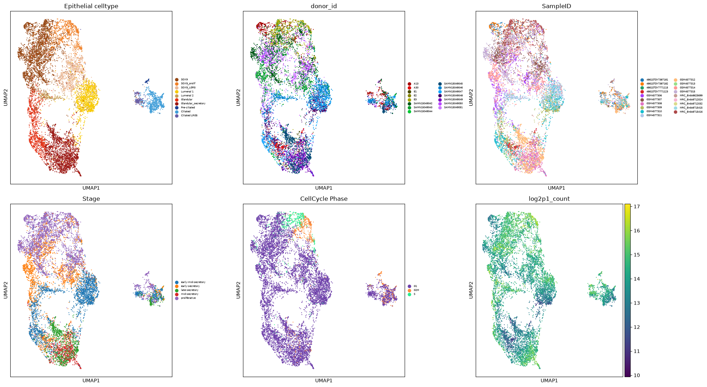

# Re-processing & annotating a published endometrium dataset

A one-week work-experience project: take a published single-cell dataset, re-process it from
raw counts with my own parameters, and compare my version against the authors' finished
product using [scanpy](https://github.com/scverse/scanpy) and
[CellTypist](https://www.celltypist.org/).

**Dataset.** Non-pregnant human uterus (endometrium, epithelial), Garcia-Alonso *et al.*,
*Nature Genetics* 2021 — [doi.org/10.1038/s41588-021-00972-2](https://doi.org/10.1038/s41588-021-00972-2),
downloaded from [CELLxGENE](https://cellxgene.cziscience.com/).

## Setup

Prerequisite: [install uv](https://docs.astral.sh/uv/getting-started/installation/).

**1. Clone the repo:**

```bash
git clone https://github.com/DrJCampbell/babs-work-experience.git
```

**2. Open the project in VS Code.** Use **File → Open Folder…** and open
`babs-work-experience/2026/Fabian` *directly* — not the whole `babs-work-experience` repo, or
the kernel picker won't find this project's `.venv`.

**3. Install the environment.** Open a terminal in VS Code and run:

```bash
uv sync
```

This reads `pyproject.toml` + `uv.lock` and installs the exact package versions this project
needs into a local `.venv/`.

**4. Run the notebook.** Open `fabian_endometrium_project.ipynb`, select `.venv/bin/python` as
the kernel (**Select Kernel → Python Environments**), and Restart → Run All. The dataset
downloads automatically on first run via `pooch`.

## Figures

The notebook re-embeds the data and compares this against the authors' published
version.

**Authors' UMAP vs my re-processed one**, both coloured by CellTypist labels. The same cell
types land in the same neighbourhoods, but my version is more fragmented — the next two figures
show why.



**What drives the islands in my embedding?** The same UMAP coloured by candidate covariates.
The islands line up most with donor / sample.



**The authors' original (integrated) embedding**, coloured by the same covariates. Here the donors are well mixed. I briefly explore batch-integration as a reason for this in the notebook's appendix.


